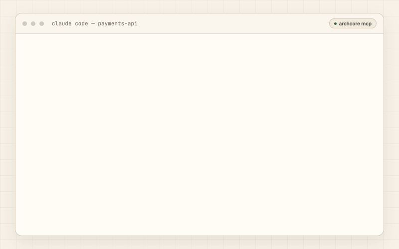

# Archcore CLI — Git-Native Context for AI Coding Agents

<!-- PLACEHOLDER: centered logo/wordmark, ~300px, light/dark variants via <picture>.
     Alt text should carry the tagline: "Archcore — git-native context for AI coding agents" -->

[](https://opensource.org/licenses/Apache-2.0)
[](https://go.dev)
[](https://github.com/archcore-ai/cli/releases)
[](https://github.com/archcore-ai/cli/releases)

**Archcore is a git-native context layer for AI coding agents.**

The CLI keeps specs, architecture decisions, rules, plans, and project knowledge in `.archcore/`, versioned with your code, and serves the relevant context to coding agents through MCP and session hooks.

It ships as a CLI and a local stdio MCP server, so any MCP-compatible coding agent can read and write your project context through standard tools. Use it for persistent project context across Claude Code, Cursor, Codex CLI, GitHub Copilot, Gemini CLI, OpenCode, Roo Code, and Cline.

## See it work

That context came from `.archcore/` — typed Markdown documents versioned in Git, served to any agent through MCP tools and session hooks.



## What changes

### ❌ Without Archcore

Every session starts from zero. The agent:

- guesses your architecture and breaks your conventions
- duplicates logic that already exists
- re-litigates decisions your team already made
- needs the same context re-explained in every chat

### ✅ With Archcore

Your decisions, rules, and conventions live in Git as structured context. The agent:

- loads the applicable decisions and rules at session start
- puts code where your architecture says it belongs
- respects the ADRs, specs, and rules already in the repo
- records new decisions as durable context — reviewable in PRs, portable across agents

> **The agent stops guessing and starts following the system.**

## Get started in 60 seconds

```bash
curl -fsSL https://archcore.ai/install.sh | bash    # macOS / Linux
cd your-project && archcore init
```

`archcore init` scaffolds `.archcore/`, detects your coding agents, and wires up hooks and MCP for them.

Then open your agent and say:

> _"We're using PostgreSQL for primary storage. Record this decision."_

Done — there is now a structured ADR in `.archcore/` that every future session, in any agent, will see.

On **Windows**: `irm https://archcore.ai/install.ps1 | iex`. For WSL, `go install`, and building from source, see [Install methods](#reference) below or the [full install guide](https://docs.archcore.ai/cli/install/).

## Works with your agent

The CLI is itself a local stdio MCP server — one integration surface for every MCP-compatible agent. Hooks add session-start context where the agent supports them.

| Agent          | Hooks | MCP    |
| -------------- | ----- | ------ |
| Claude Code    | yes   | yes    |
| Cursor         | yes   | yes    |
| Gemini CLI     | yes   | yes    |
| GitHub Copilot | yes   | yes    |
| OpenCode       | —     | yes    |
| Codex CLI      | —     | yes    |
| Roo Code       | —     | yes    |
| Cline          | —     | manual |

`archcore init` configures detected agents automatically. To wire one up by hand:

```bash
archcore mcp install --agent cursor      # write MCP config for a specific agent
archcore hooks install                   # install session-start hooks for detected agents
claude mcp add --transport stdio archcore -- archcore mcp   # or add the server manually
```

## How it works

1. **Initialize** — `archcore init` creates `.archcore/` and installs agent integrations.
2. **Capture** — decisions, rules, plans, and guides are stored as typed Markdown documents with YAML frontmatter.
3. **Reuse** — agents read, create, update, and link documents through MCP tools while they work; hooks load context at session start.
4. **Keep it in Git** — review context changes like code, evolve them over time, keep them portable across tools.

```text
.archcore/
├── settings.json
├── auth/
│   ├── jwt-strategy.adr.md
│   └── auth-redesign.prd.md
├── backend/
│   └── error-wrapping.rule.md
├── incidents/
│   └── connection-pool-exhaustion.cpat.md
└── notifications/
    └── notifications-implementation.plan.md
```

The structure is free-form — organize by domain, feature, or team. A document's type lives in its filename (`slug.type.md`): 19 types across three layers — knowledge (ADRs, rules, specs, guides), vision (PRDs, plans, ideas, requirements tracks), and experience (incident patterns, recurring tasks). This repo's own [`.archcore/`](https://github.com/archcore-ai/cli/tree/main/.archcore) is a working example.

## Ask your agent

> _"Before I touch the auth module, what decisions and rules apply here?"_

Loads the ADRs and rules tied to that area before the agent edits a single line.

> _"We have a convention: always wrap errors with fmt.Errorf and %w. Make this a rule."_

Creates `backend/error-wrapping.rule.md` with imperative guidance, rationale, and good/bad examples.

> _"Last week we had a connection-pool exhaustion incident. Document it so we don't repeat it."_

Creates `incidents/connection-pool-exhaustion.cpat.md` with root-cause analysis and prevention steps.

## How it compares

| If you rely on…                                          | The gap                                                                           | What Archcore does instead                                                                          |
| -------------------------------------------------------- | --------------------------------------------------------------------------------- | --------------------------------------------------------------------------------------------------- |
| **Nothing**                                              | The agent re-learns your repo every session and re-litigates settled decisions    | Loads decisions, rules, and conventions at session start — in any agent                             |
| **Flat instruction files** (`CLAUDE.md`, `.cursorrules`) | One growing wall of text — no types, no links, no lifecycle, copy-pasted per tool | Typed documents, a relation graph, a draft → accepted lifecycle, one setup for every agent          |
| **Memory tools** (claude-mem, Mem0)                      | Remember _what you did_ — volatile, opaque, vendor-bound                          | Stores _how the system is built and what was decided_ — versioned in Git, owned by you              |
| **Methodology kits** (BMAD, Spec Kit, Agent OS)          | Prescribe a process, often as a one-shot handoff                                  | Stores the artifacts — a living context graph that evolves with the codebase                        |
| **RAG / a bigger context window**                        | Retrieves what the code _says_, not what was _decided and why_                    | Keeps decisions and rationale explicit and selective — the agent loads what applies, not everything |

**Not for** — chat memory, a prompt library, or a one-shot spec-to-code generator. Archcore is a repo truth layer for coding agents, not a methodology kit.

## Reference

What ships in the box: **19 document types**, **4 relation types**, **10 MCP tools**, hook integrations for 4 agents and MCP integrations for 8.

<details>
<summary><strong>Document types</strong> — 19 types across vision, knowledge, and experience</summary>

### Knowledge

| Type    | Full Name                    | Description                                                                          |
| ------- | ---------------------------- | ------------------------------------------------------------------------------------ |
| `adr`   | Architecture Decision Record | Captures a finalized technical decision with context, alternatives, and consequences |
| `rfc`   | Request for Comments         | Proposes a significant change open for team review and feedback                      |
| `rule`  | Rule                         | Coding or process standard with imperative guidance and examples                     |
| `guide` | Guide                        | Step-by-step instructions for completing a specific task                             |
| `doc`   | Document                     | Reference documentation, registries, and descriptive material                        |
| `spec`  | Specification                | Normative behavior contract for a boundary or feature/subsystem others rely on       |

### Vision

| Type   | Full Name                     | Description                                                               |
| ------ | ----------------------------- | ------------------------------------------------------------------------- |
| `prd`  | Product Requirements Document | Goals, user stories, acceptance criteria, and success metrics             |
| `idea` | Idea                          | Lightweight capture of a product or technical idea for future exploration |
| `plan` | Plan                          | Phased task list with acceptance criteria and dependencies                |
| `rnd`  | Research                      | Time-boxed investigation that answers a question blocking a decision      |

Two additional requirements tracks for teams that need structured discovery or formal decomposition:

**Sources track** (MRD → BRD → URD) — captures _where_ requirements come from:

| Type  | Full Name                      | Description                                                              |
| ----- | ------------------------------ | ------------------------------------------------------------------------ |
| `mrd` | Market Requirements Document   | Market landscape, TAM/SAM/SOM, competitive analysis, and market needs    |
| `brd` | Business Requirements Document | Business objectives, stakeholders, ROI, and business rules               |
| `urd` | User Requirements Document     | User personas, journeys, usability requirements, and acceptance criteria |

**ISO/IEC/IEEE 29148:2018 track** (BRS → StRS → SyRS → SRS) — captures _how_ requirements decompose:

| Type   | Full Name                              | Description                                                            |
| ------ | -------------------------------------- | ---------------------------------------------------------------------- |
| `brs`  | Business Requirements Specification    | Mission, goals, objectives, and business operational concept           |
| `strs` | Stakeholder Requirements Specification | Stakeholder needs, operational concept, and user requirements          |
| `syrs` | System Requirements Specification      | System functions, interfaces, performance, and design constraints      |
| `srs`  | Software Requirements Specification    | Software functions, external interfaces, and detailed behavioral specs |

Use PRD for most projects; add the sources track for structured requirement discovery, and ISO 29148 for formal traceability in regulated or complex multi-team systems. Mix freely.

### Experience

| Type        | Full Name           | Description                                                    |
| ----------- | ------------------- | -------------------------------------------------------------- |
| `task-type` | Task Type           | Reusable checklist and workflow for a recurring task           |
| `cpat`      | Code Change Pattern | Root-cause analysis of a bug or incident with prevention steps |

Each document is a Markdown file with YAML frontmatter:

```markdown
---
title: "Use PostgreSQL for Primary Storage"
status: draft
tags: [database, infrastructure]
---

## Context

...
```

Valid statuses: `draft`, `accepted`, `rejected`. Tags are optional and free-form.

</details>

<details>
<summary><strong>MCP tools and relations</strong></summary>

### MCP tools

10 tools: `init_project`, `list_documents`, `get_document`, `search_documents`, `create_document`, `update_document`, `remove_document`, `add_relation`, `remove_relation`, `list_relations`. The server also works in an empty repo — agents can bootstrap `.archcore/` themselves via `init_project`.

### Relations

Documents link with directed relations: `related` (general association), `implements` (source implements what target specifies), `extends` (source builds upon target), `depends_on` (source requires target). Managed by the agent through MCP tools.

### Local MCP server

`archcore mcp` serves documents from the current directory over stdio. Pass `--project /path/to/repo` (or set `ARCHCORE_PROJECT_ROOT`) when the server is launched from a directory that isn't your workspace — for example, by an editor integration.

</details>

<details>
<summary><strong>Commands</strong></summary>

| Command                  | Description                                      |
| ------------------------ | ------------------------------------------------ |
| `archcore init`          | Initialize `.archcore/` directory interactively  |
| `archcore doctor`        | Check your archcore setup and fix issues         |
| `archcore status`        | Check `.archcore/` structure and document health |
| `archcore config`        | View or modify settings                          |
| `archcore hooks install` | Install hooks for detected AI agents             |
| `archcore mcp`           | Run the MCP stdio server                         |
| `archcore mcp install`   | Install MCP config for detected agents           |
| `archcore update`        | Update Archcore to the latest version            |

`archcore update` checks GitHub Releases, downloads the newer version, verifies the SHA-256 checksum, and atomically replaces the binary.

</details>

<details>
<summary><strong>Install methods</strong></summary>

### macOS / Linux

```bash
curl -fsSL https://archcore.ai/install.sh | bash
```

### Windows

```powershell
irm https://archcore.ai/install.ps1 | iex
```

Installs `archcore.exe` under `%LOCALAPPDATA%\Programs\archcore` and adds it to your user `PATH`. Open a new PowerShell window after install.

### Windows (WSL)

Install [WSL](https://learn.microsoft.com/en-us/windows/wsl/install), then run the macOS/Linux script inside it.

### Go install

```bash
go install github.com/archcore-ai/cli@latest
```

### From source

```bash
git clone https://github.com/archcore-ai/cli.git
cd cli
go build -o archcore .
```

**Supported platforms:** macOS, Linux, Windows — amd64 and arm64.

For environment variables (`ARCHCORE_VERSION`, `ARCHCORE_INSTALL_DIR`, `GITHUB_TOKEN`) and PATH troubleshooting, see the [full install guide](https://docs.archcore.ai/cli/install/).

</details>

<details>
<summary><strong>Configuration</strong></summary>

Settings live in `.archcore/settings.json`, created by `archcore init`.

| Field      | Description                                                                      | Values                                  |
| ---------- | -------------------------------------------------------------------------------- | --------------------------------------- |
| `sync`     | Sync mode. Cloud and on-prem are coming soon.                                    | `none` (local only), `cloud`, `on-prem` |
| `language` | Document language. Helps the agent generate documentation in the right language. | String, defaults to `en`                |

```bash
archcore config                    # show all settings
archcore config get <key>          # get a specific value
archcore config set <key> <value>  # set a value
```

</details>

## Ecosystem

- **[Archcore Plugin](https://github.com/archcore-ai/archcore-plugin)** — using Claude Code or Cursor? The plugin pairs with the CLI: same engine, plus skills, intent commands, and guardrails. One product, two entry points — the CLI on its own covers every other agent.
- **[docs.archcore.ai](https://docs.archcore.ai)** — full documentation.
- **[`.archcore/` in this repo](https://github.com/archcore-ai/cli/tree/main/.archcore)** — a living example: the CLI is built with its own context layer.

## Development

Requires Go 1.25+.

```bash
go build -o archcore .   # build
go test ./...            # run all tests
```

## Links & license

- **Documentation:** [docs.archcore.ai](https://docs.archcore.ai)
- **Website:** [archcore.ai](https://archcore.ai)
- **Plugin (Claude Code, Cursor):** [github.com/archcore-ai/archcore-plugin](https://github.com/archcore-ai/archcore-plugin)
- **Issues:** [github.com/archcore-ai/cli/issues](https://github.com/archcore-ai/cli/issues)
- **License:** [Apache 2.0](LICENSE)
